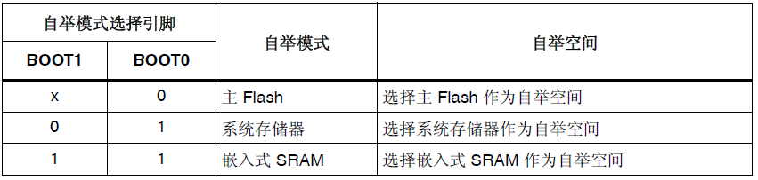
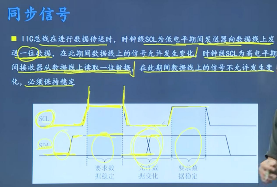

[TOC]

# C语言

---

## 关键字

### volatile 易变的

主要是防止编译器对变量进行优化

```c
int a,b;    //为a b申请内存
a = 1;      // 1-> CUP  CPU -> 内存(&a)
b = a;      //内存(&a)->CPU CPU->内存(&b)
c = b;      //优化则不需要重新内存a到CPU，直接将CPU中的a传递给c
            //加上修饰后则重新去内存取值
```

哪些情况使用volatile

- 并行设备的硬件寄存器

- 中断服务程序中修改的供其他程序检测的变量

- 多线程中被几个任务共享的变量

### unsigned 无符号数据类型

```c
void foo(void){
    unsigned int a = 6;
    int b = -20;
    (a+b>6)? puts(">6"):puts("<=6")
}
```

这无符号整型问题的答案是输出是 “>6”。原因是当表达式中存在有符号类型和无符号类型时所有的操作数都**自动转换为无符号类型**。因此-20变成了一个**非常大的正整数**，所以该表达式计算出的结果大于6。这一点对于应当频繁用到无符号数据类型的嵌入式系统来说是丰常重要的。

### Const 常量修饰符

阻止一个变量被修改

### typedef 和 define 的区别

**1.原理不同**

 #**define是预处理指令**，在**预处理**时进行简单而机械的**字符串替换**，不做正确性检査。 例如， # define Pl 3.1415926 ，当程序执行 area=PI * r 语句时，PI会被替换为3.1415926。于是该 语句被替换为 area=3.1415926*r 。如果把# define语句中的数字9写成了g，预处理也照样代入，而不去检查其是否合理、合法。 **typedef是关键字**，它在**编译**时处理，所以 typedef具有**类型检查**的功能。它在自己的作用域内给一个已经存在的类型一个别名，但是不能在一个函数定义里面使用标识符 typedef。例如，typedef int INTEGER ，这以后就可用 INTEGER来代替int作整型变量的类型说明了，例如：INTEGER a,b; 用 typedef定义数组、指针、结构等类型将带来很大的方便，不仅使程序书写简单而且使意义更为明确，因而增强了可读性。例如： typedef int a[10]; 表示a是整型数组类型，数组长度为10。然后就可用a说明变量，例如:语句a s1,s2；完全等效于语句 int s1[10],s2[10].同理， typedef void（*p）（void)表示p是一种指向void型的指针类型。
**2.功能不同**

typedef 用来定义类型的别名，起到使类型易于记忆的功能

**3.作用域不同**

define没有作用域

typedef有自己的作用域

```c
void fun(){
    #define A int 
    #typedef B float
}
void gun(){
    //这里可以使用A但是不能使用B
}
```

---

## 内存管理

### 内存四区

**代码区**     .text（代码区）.rodata(常量区)

所有的可执行代码（程序代码指令、常量字符串等）以及函数

**全局静态区**  .data(已初始化全局/静态变量) .bss(未初始化/初始化为0)

存放所有 全局变量和静态变量

**堆区** .Heap

动态内存分配

**栈区** .Stack

局部变量、函数形参等

### 内存泄漏

栈区：局部变量过大或者多层函数嵌套

堆区:malloc内存后未释放

### 栈溢出

栈大小只有几MB，当程序试图使用的栈空间超过其最大容量时，就会触发栈溢出，导致程序崩溃（如段错误或系统强制终止）

无限递归、过大的局部变量、过深的函数嵌套

栈和堆地址连续，入栈元素过多会影响到堆，申请内存过大会也影响到栈

### new/delete与malloc/free的区别是什么

     对于类的对象而言，malloc/free无法满足**动态对象**的要求，对象在创建时要自动执行**构造函数**，在对象消亡之前要自动执行**析构函数**，而malloc/free 不在编译器控制权限之内，**无法执行**构造函数和析构函数。

    当然对于没有**资源要清理**的类，不调用析构函数也没有太大的问题，即使用free或delete没有区别。但万一有一些类的成员是**指针**，而这个指针又在**堆上开辟了空间**，这时不调用析构函数去释放这个指针指向的这段空间，就会造成**内存泄漏**。**delete**会调用析构函数，释放**指针成员变量**的空间，再**销毁对象本身的空间**；而**free**只释放了**对象本身的空间**，而**指针**成员所指向的空间**没有被释放**

- new能自动计算需要分配的内存空间，malloc需要手动计算字节数

- new/delete带具体类型指针，malloc/free返回**void**指针

- new/free将调用构造/析构函数，malloc/free不能

- new/free**不需要**库文件支持，malloc/free需要<stdlib.h>支持

注：delete和free被调用后，内存**不会立即**收回，指针也不会**指向空**，delete或free仅仅是**告诉操作系统**，这一块内存**被释放**啦，还可以做其他用途。由于没有对这块内存进行写操作，所以内存中的变量数值并没有发生变化，出现**野指针**的情况，因此，释放完内存后需要将指针向量**置为空**。

### 局部变量未定义时为什么每次初始化的结果是不确定的？是个真随机数还是个伪随机数？

**局部变量未初始化**

局部变量存储在栈中，是动态存储方式，如果声明了一个变量，系统给这个变量分配了一块内存，这块内存可能存有之前使用过的值，这个值可能是任意值，如果新声明的这个变量没有被初始化，就相当于系统把这块内存中之前存在的值赋给了新声明的变量，这个值可能是任意值，因此得到的就是一个随机值，这种结果无法预测，可能导致灾难性的后果

**全局变量未初始化**

全部变量采取的是静态存储方式，在没有初始化之前，被放在BSS段中，操作系统在调用一个程序之前，会执行一段代码，这段代码会将BSS段中的空间全部清零，所以全局变量如果未初始化，其值就是0。

 **嵌套调用时**：局部变量如未定义为静态变量的话会出现**悬空指针**

### 字节对齐

**结构体字节对齐：**[结构体字节对齐](https://c.biancheng.net/view/243.html)

    以结构体成员中占**内存最多**的数据类型所占的字节数为标准,所有的成员在分配内存时都要与这个长度对齐。所有成员在分配内存时都是紧接在前一个变量后面**依次填充**的,如果不足以填充**另起一行**分配，**各类型成员的前后位置会对字节数产生影响**

注：char a[10] 的本质是 10 个 char 变量

**union判断大小端**

```c
   // 定义一个 union，包含 int 和 char[4]
    union {
        int i;        // 整数成员，通常占 4 字节
        char c[4];    // 字符数组成员，用于访问整数的每个字节
    } endianTest;

    // 设置整数值为 0x01020304（十六进制）
    endianTest.i = 0x01020304;

    // 检查字符数组的第一个字节（c[0]）
    endianTest.c[0] == 0x01)    "系统是大端（Big-endian）\n");
    endianTest.c[0] == 0x04)    "系统是小端（Little-endian）\n");
```

## 其他问题

### 编译过程

**1.预处理阶段**   hello.c -> hello.i

处理所有以`#`开头的指令

- 头文件展开：将`#include <stdio.h>`替换为整个stdio.h文件的内容

- 宏替换：处理`#define`定义的宏

- 条件编译：处理`#ifdef`、`#ifndef`等条件编译指令

- 删除注释

**2.编译阶段**     hello.i ->hello.s

将预处理后的C代码转换为**汇编语言**

**3.汇编阶段**   hello.s -> hello.o

汇编器将人类可读的汇编代码转换为机器码

- 汇编指令 -> 机器指令

- 生成目标文件（.o文件）

- 创建符号表，记录函数和变量地址信息

此时的.o文件包含二进制机器码，但是还不能直接执行，缺少一些关键信息

**4.链接阶段**     hello.o -> hello

将多个目标文件和库文件组合成最终的可执行文件

### 大小端

大端：高地址存低字节，低地址存高字节  
小端：低地址存低字节，高地址存高字节

---

# 硬件

## 启动与引导

### 启动流程

1.内核初始化;
2.强制PC指针指向中断向量表的复位中断向量执行复位中断函数;
3.在复位中断函数中调用 SystemInit 函数，初始化时钟，配置中断向量表等
4.调用 __main 函数完成全局/静态变量的初始化和重定位工作，初始化堆栈和库函数
5.跳转到main函数中执行

> 1. 未初始化和初始值为零的全局变量，静态变量一般在RAM中, 初始值不为零的全局变量/静态变量 一般在FLASH中。
> 2. Flash不能随机写（只能写0，不能写1）在程序运行之前将初始值不为零的全局变量重定位到RAM中。
> 3. 全局变量和常量的地址在编译时都已经被分配好了（所以能够在 .map 文件中看到）, 而局部变量则是程序运行时在栈中创建的，栈空间大小可以在IDE中设置。

### BOOT启动方式

[STM32的完整启动流程分析](https://blog.csdn.net/Setul/article/details/121685929)

根据引脚boot决定三种启动方式



   BOOT0 为专用引脚，而 BOOT1 则与 GPIO 引脚共用。完成对 BOOT1 的采样，相应 GPIO 引脚即进入空闲状态，可用于其它用途。

- 从**主Flash**启动。主Flash指的是STM32的**内置Flash**。内置Flash的起始地址将被重映射到0x00000000地址，代码将在该处开始执行。一般我们使用**JTAG或者SWD模式**下载调试程序时，就是下载到这里面，**重启后也直接从这启动**。

- 从**系统存储器**启动。系统储存器指的是STM32的**内置ROM**，选择该启动模式后，内置ROM的起始地址将被重映射到0x00000000地址，代码在此处开始运行。ROM中有一段**出厂预置**的代码，这段代码起到一个**桥的作用**，允许外部通过**UART/CAN或USB等将代码写入STM32的内置Flash**中。这段代码也被称为**ISP**(In System Programing)代码，这种烧录代码的方式也被称为**ISP烧录**。关于ISP、ICP和IAP之间的区别将在后续章节中介绍。

- 从嵌入式**SRAM**中启动。显然，该方法是在STM32的内置SRAM中启动，选择该启动模式后，内置SRAM的起始地址将被重映射到0x00000.这种模式由于烧录程序过程中**不需要擦写Flash，因此速度较快，适合调试，但是掉电丢失。**

> 即使相应的内存被映射到了0x00000000起始的地址，通过其原来地址依然是可以访问的。

### 启动后bootloader做了什么？

根据boot确定启动方式后，从0x00000000地址处开始执行代码即**bootloader**（启动文件）

>  bootloader：负责执行微控制器从“复位”到“开始执行main函数”**中间这段时间**(称为启动过程)所必须进行的工作

.data和.bss涉及读写，为了更高的读写效率，要搬到RAM中执行，有lootloader来执行，在RAM中初始化，完成后将代码交给main函数执行用户代码

## 储存器

### RAM

RAM 叫做随机存储器，是**直接和 CPU 进行交互的内存**（主存），通常作为**正在运行程序和临时数据**的存储煤质

RAM 分类：
静态 SRAM： SRAM，速度比 DRAM 快，不需要时钟同步
动态 DRAM：同步动态 RAM ，需要周期性刷新，密度比 SRAM 高，需要时钟同步

**片内 ram** 集成在 CPU 芯片内部，它是在 CPU 设计时就加上的，它使用和 CPU 几乎一样的制作工艺和材料，而且增加了芯片的大小，所以成本比较高，一般也就只有几十 K 字节，好钢当然要用在刀刃上，片内 ram 用来**存放中断处理 handler、RTOS 调度器、任务上下文切换、内存分配释放等使用频率最高的代码和中断堆栈这种读写频率极高的内存区**，如果有多余的部分也可以放一些经常被引用到的全局变量
片外 RAM 一般就是采购的市面上的成品，如 Samsung，Hynix，Apmemory 等，价格相对便宜，其容量的可选范围也较为宽松，从几 M 到几 G 的都有，它可以用来存储全局变量，bss，以及我们常用到的 malloc 所分配的堆空间等。

### ROM

只读存储器，RAM 和 ROM 两者的最大区别是 **RAM 在断电**以后保存在上面的数据会**自动消失**，而 **ROM 可以长时间断电保存**

ROM 一般是有两种：
        一种是指集成在 **CPU 芯片内部**的一块只读存储区域，一般是几 K 到几十 K 字节大小，用来存储系统刚上电时对 cpu 和一些核心外设（如时钟，串口，MMU、DRAM、Flash 等）进行**初始化的代码**，它在程序运行中也是不可写的，要对它执行写操作只能使用硬件烧写器进行，也就是一般所说的下载程序，这部分的代码在芯片测试阶段可以进行编程器下载更新，量产后一般就会固化，不能做任何修改的；
        ROM 另一种指的就是**flash**， flash 里存放的代码是可以由 CPU直接取指并执行的，而 PC 上硬盘里的程序都需要加载到内存里才能运行

## 外设

### GPIO工作方式

输出：推挽输出，开漏输出，复用推挽输出，复用开漏输出。

> 复用功能：GPIO引脚用于外设功能，如UART，SPI，PWM等。

输入：上拉输入，下拉输入，浮空输入，模拟输入。

- 推挽输出：对**高低电平**均有驱动能力，**不用**设置上拉电阻。可简单理解既可**输出高电平**，也可**输出低电平**。 **输出可1可0**。

- 开漏输出：只对**低电平**有驱动能力，想要输出高电平必须设置上拉电阻。简单理解，只能输出低电平，无法输出高电平。只能输出0。

> - 相较于推挽的好处: 可以实现**线与** 多个信号线直接连接在一起，只有当所有信号全部为高电平时，合在一起的总线为高电平；只要有任意一个或者多个信号为低电平，则总线为低电平;推挽就不行,直接就烧毁了

- 上拉输入：可读取引脚电平，内部**外接上拉电阻**，悬空时**默认高电平**。

- 下拉输入：可读取引脚电平，内部外**接下拉电阻**，悬空时**默认低电平**。

- 浮空输入：可读取引脚电平，若引脚**悬空，电平为不确定**状态。

- 模拟输入：GPIO无效，引脚**直接接入内部ADC**

### DMA

什么是DMA？
允许外部设备在不经过CPU的情况下直接与内存进行数据传输。这种技术能够显著提高数据传输的效率，减轻CPU的负担，从而提升系统的整体性能

> 正常的逻辑是，cpu读取RAM中的数据，再由他发送给外设，cpu全程参与
> 
> 引入DMA，就不需要CPU干预存储操作

## 中断

### 中断ISR

中断ISR不同于其他用户软件程序，属于一类特殊的函数，原因入下：

1. 中断ISR必须是**void型的无参数**传递函数--无形参无返回值；

2. 中断ISR由**硬件外设触发**，而非其他函数调用，其运行时机具有**随机不确定性和硬件实时性**

3. 中断ISR运行**时间必须尽量短**，以**保证**外设中断的**实时性**；

在中断ISR中需要完成以下工作：

1. 将引起该中断请求的**外设中断标志清除**，**保证外设不**因该中断ISR运行而**丢失下一次中断**，而CPU在中断退出后可以处理其他任务；

2. 处理外设中断事件，典型如定时计数，通信外设RX数据接收或者TX数据buffer填充等；

    为了保证中断的实时性，中断ISR程序要尽量短，不能条件等待语句甚至将死循环语句放在中断ISR内。建议用户一般只把关键处理放在中断ISR中，其他相关的一般性工作放在主程序中执行。典型例子如CAN的数据接收放在CAN RX 中断ISR中，而通过全局变量通知主程序执行相关的诊断协议(如UDS)。

### 中断嵌套

是指在外设中断具有不同的优先级，在CPU响应**低优先级**中断的时候(也就是运行中断ISR时)，**打开CPU全局中断**，如果此时有更**高优先级**的中断到来，CPU能够**停下**当前的中断处理区响应优先级高的中断，从而**保证高优先级任务外设响应实时性**的情况

### 中断向量表

中断向量表是一个存储中断服务程序入口地址的数组或表格，每个中断源对应一个表项。

作用：

- 提供中断源与对应服务程序之间的映射关系
- 使CPU能够快速找到并跳转到正确的中断服务程序
- 支持多种中断源的统一管理

Cortex-M 的中断向量表中列举出了所有的中断，每一个中断对应一个中断服务函数；而 Cortex-A 的中断向量表则是将中断分为了 7类

### 中断里为什么不能用延时？

中断服务程序的原则是**短小精悍**，只做最必要的快速处理。延时函数让**CPU停在中断**里，会影响系统实时性，甚至造成**事件丢失**，尤其是HAL_Delay这种基于systick的延时，还可能造成**死锁**

在工程实践中，一般只做**标记位/投递消息**，把需要延时的逻辑放到主循环里去处理。

> HAL_Delay靠systick中断递增系统时基，通常优先级更低。在ISR里，无法抢占当前中断，`uwTick`不断增长，`HAL_Delay`的轮询条件永远成立，于是把CPU卡死在ISR里；
> 
> 就算提高优先级，也会把ISR延长到毫秒级，破坏实时性

---

# 通信

## IIC（串行同步半双工）

### IIC时序

1. 开始信号：SCL高电平，SDA从高到低，即出现下降沿为开始

2. 停止信号：SCL为高电平，SDA从低变高，即出现上升沿结束

3. 读取数据：SCL为低时SDA可以变化（准备数据），SCK为高时，SDA必须保持稳定（数据有效）。数据按（高位有限）MSB优先传输

4. 应答机制：每传输8位数据，接收方需要给出应答位ACK(低电平)表示成功接收。NACK(高电平)表示接受失败或结束接收



### IIC通信过程

由主机**发起启用总线**，这个时候其他器件就会知道**总线被占用**就不会去启动总线
1）主机发送一个字节：字节里面指明要和谁通信和通信的方向是读还是写，这个时候其他器件就回去比较自己的器件地址，看看是不是自己

> 这个时候**确定通信方向**之后后面就**不能改变**通信方向，**直到通信结束**

2）从机对比自己是在叫自己之后就会回应主机
3）发送器发送数据
4）接收器发送回应信号
5）不断循环 4、5
6）主机发起停止信号，释放总线

### IIC为什么要加上拉电阻？

1. 实现**线与逻辑**：IIC中多个设备共享同一条总线，上拉电阻可以将总线拉至高电平（空闲状态），任何设备都可以通过将总线拉低来发送信号。

2. IIC总线的两个引脚都配置为**开漏输出**，开漏输出**无法输出高电平**，只能输出低电平，上拉电阻**提供了将总线拉回高电平的能力**。加入上拉电阻后可以让引脚输出高电平。

3. **防止总线冲突**：当多个设备同时访问总线，上拉电阻配合开漏输出可以防止短路。

4. **定义总线空闲状态**：上拉电阻确保总线在无设备通信时保持高电平，也就是空闲状态。

> 经典的上拉电阻阻值为4.7KΩ。具体值需要根据以下因素选择：
> 
>     总线电容/通信速率/设备数量/电源电压
> 
> 标准：4.7kΩ
> 
> 低俗场景：4.7k-10k
> 
> 快速模式：2.2k-4.7k
> 
> 高速模式：1k-2.2k

### IIC为什么要使用开漏输出？

- 实现**线与**功能。开漏输出允许多个设备同时共享同一条总线而不造成冲突。

- **电平转换**：不同电压域的设备可以在同一总线上通信，只需使用与最高电压匹配的上拉电阻。

- **时钟同步**：开漏结构可以使从设备通过拉低SCL线延长时钟周期，保证较慢的从设备与主设备同步。

- **仲裁机制**：在多主机环境中，开漏结构可以实现无损仲裁（低电平优先）

### IIC的地址位数是多少

一般是7位地址格式，传输时占一个字节，7位地址+1位读写位。理论上可用的是127个（2^7-1），0x00地址保留。实际可用的是126个，**0x00和0x7F地址保留**。

可拓展10位地址格式。理论上可用也是1023（2^10-1），0x00地址保留

### IIC多主机通信竞争流程

通过以下机制：

- 总线仲裁：低电平优先，线与逻辑，谁先发低谁获得总线控制权

- 时钟同步：任一主机拉低SCL，总线立即变低，**强制所有主机进入低电平周期**只有所有设备**同时释放SCL**，总线才会被拉高，因此所有设备会以最慢的设备时钟速率运行，以保证时钟同步

- 冲突检测：主机发送每一位数据时都会检查SDA线实际电平，如果检测到的电平与期望发送的不同，则失去仲裁权。

具体步骤：

**步骤1：总线空闲检测**

- 所有主机检测SDA（数据线）和SCL（时钟线）是否均为高电平。
- 若总线空闲（高电平），任一主机可发起通信。

**步骤2：起始条件（START Condition）竞争**

- 多个主机可能同时发送起始条件（SDA从高→低，SCL为高）。

- 由于“线与”特性，只要有一个主机拉低SDA，总线即被占用，其他主机需等待。

**步骤3：地址与数据的逐位仲裁**

- **关键原理**：主机在发送地址或数据时，会实时监测总线状态：
  
  - 若主机发送位为 **1**（释放SDA，期望高电平），但检测到总线为 **0**（被其他主机拉低），说明竞争失败。
  - 若发送位与总线状态一致，则继续发送下一位。

- **仲裁过程**：
  
  1. 主机A发送位 `1`，主机B发送位 `0`：
     - 总线被拉低（主机B获胜）。
     - 主机A检测到总线状态与自身发送位不符，立即退出并转为从机模式。
  2. 主机A和B均发送相同位（如 `0`）：
     - 仲裁继续，直到出现不同位。

- **仲裁优先级**：从高位（MSB）到低位（LSB）逐位比较，先出现低电平的主机获胜（低电平优先级更高）。

**步骤4：仲裁失败主机的处理**

- 失败的主机：
  - 停止发送数据，释放SDA和SCL。
  - 转为从机模式，监听总线。
  - 等待总线空闲后重试。

**步骤5：获胜主机完成传输**

- 获胜主机继续发送数据，直到传输结束（发送STOP条件）。
- 其他主机在总线空闲后可重新竞争。

### I2C通信中常见的问题及解决方案？

1. 总线死锁：症状：SDA或SCL被某个设备一直拉低解决方案： 软件复位：主机产生9个时钟脉冲，尝试完成被中断的传输硬件复位：复位所有I2C设备电源循环：关闭再打开电源
2. 地址冲突：症状：多个设备使用相同地址解决方案： 使用带地址选择引脚的器件使用I2C地址转换器使用多总线设计
3. 时序问题：症状：高速通信时数据错误解决方案： 减小上拉电阻值（注意功耗增加）减少总线电容（缩短线长、减少设备数量）降低通信速率
4. 噪声干扰：症状：通信不稳定，偶发错误解决方案： 使用屏蔽线缆增加滤波电容优化PCB布局，避免I2C线与高速信号线并行

### I2C与SPI的对比及选择依据？

**I2C优势**：

- 只需两根信号线
- 支持多主机、多从机
- 内置寻址机制
- 支持时钟拉伸（适应不同速度设备）

**I2C劣势**：

- 速度较慢
- 协议开销较大
- 实现复杂度较高

**选择I2C的场景**：

- 系统中有多个相同类型的设备需要连接
- PCB空间或引脚资源有限
- 通信速度要求不高
- 需要标准化的协议


## SPI（串行同步全双工）

### SPI的有几根线，可以去除几根线

SPI总共有4根线。

SCLK：时钟线，用于同步数据传输时的时序控制

MOSI：主设备输出，从设备输入线。

MISO：主设备输入，从设备输出线。

CS：片选线，用于选择对应的从机设备。

如果不需要双向通信，MOSI，MISO其中一根线可以去除。如果是一对一通信，CS片选线也可以去除。最少两根线即可。
